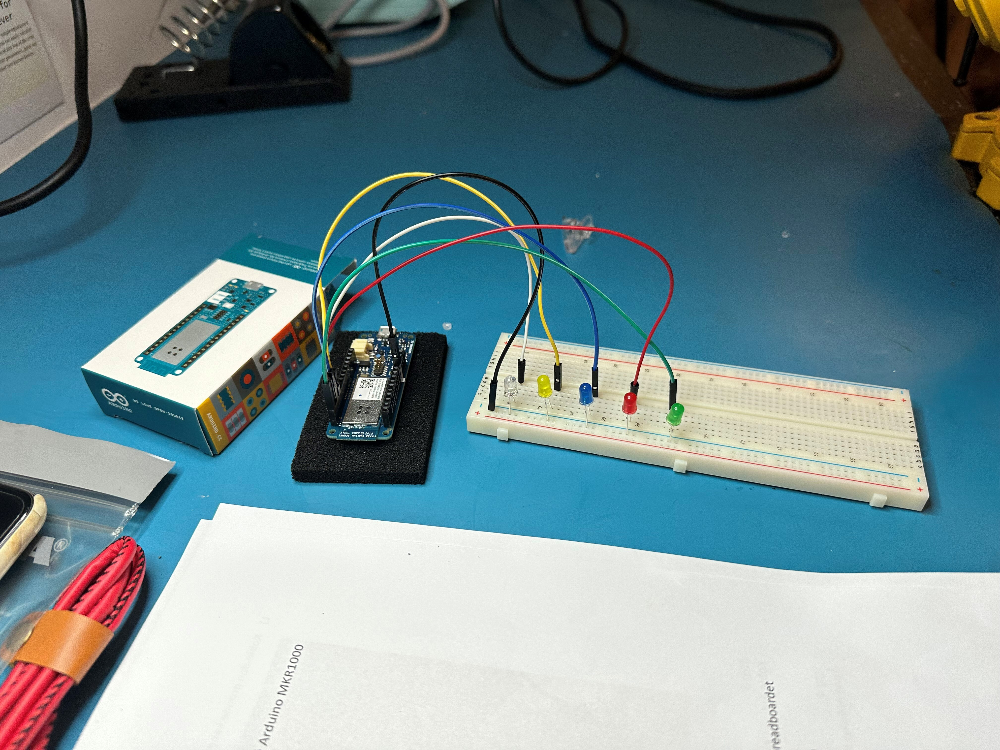
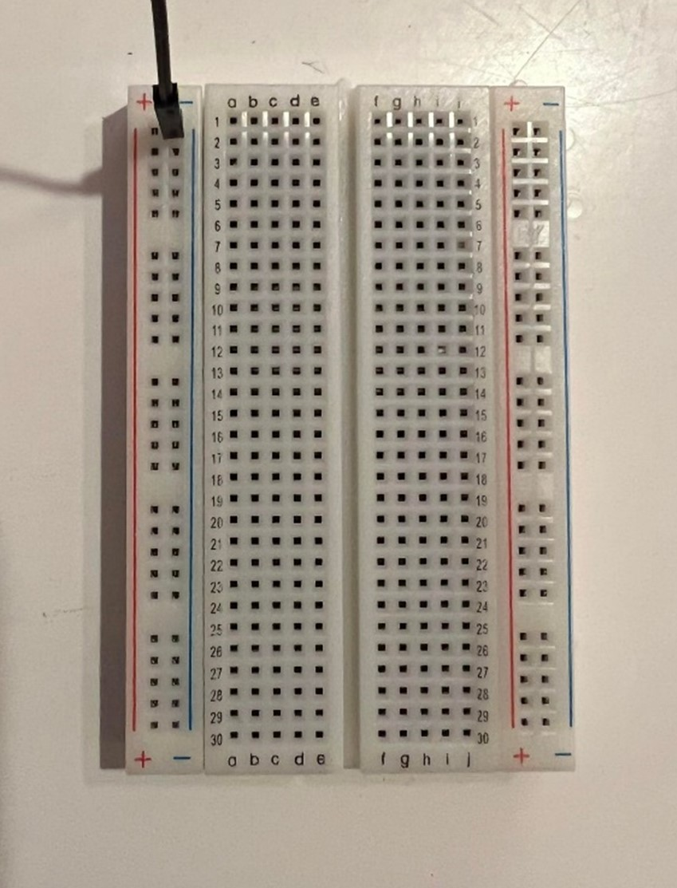
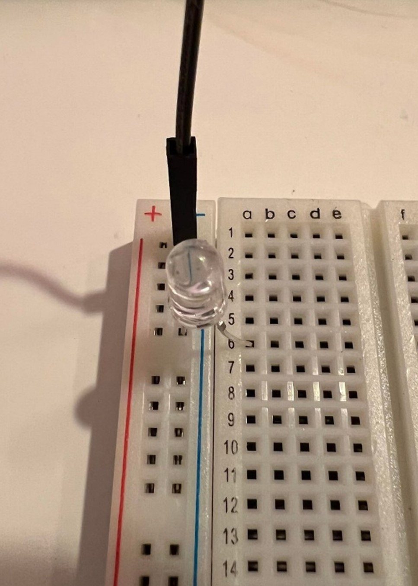
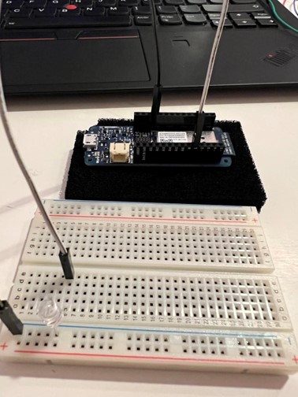
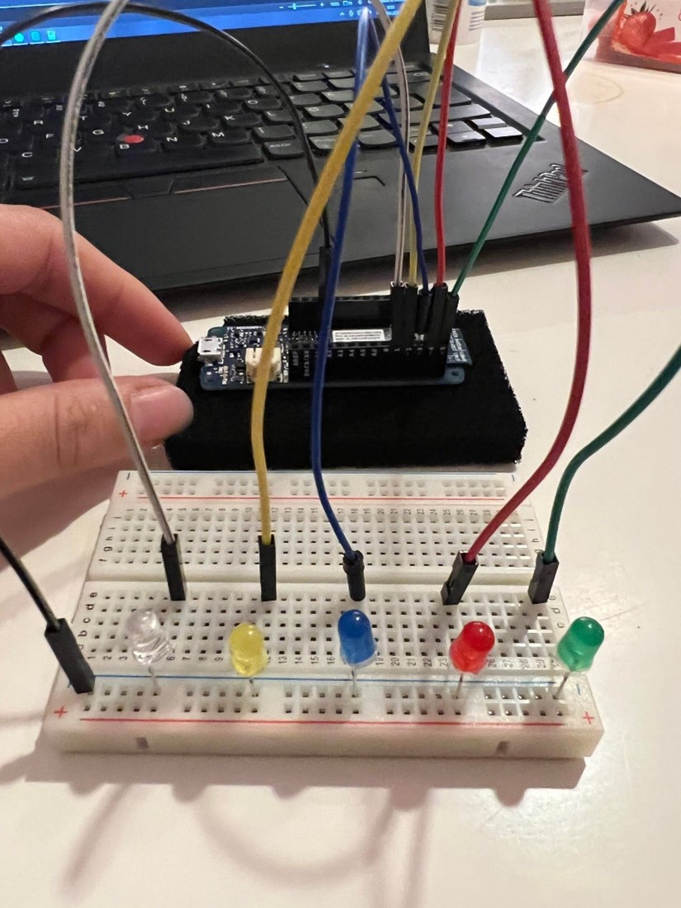
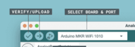

# Programmer julelys med Arduino og LEDs

## Komponentliste

| Komponent | Beskrivelse | Antall |
|-|-|-|
| PCer | For kjøring av kode | 1 |
| Arduino IDE | Arduino sitt eget kodeprogram | 1 stk |
| Kode | Open source kodesnipp fra Arduino | 1 |
| Arduino | Microcontroller som vi kjører programmet inn på | 1 stk |
| Koblingsbrett | Også kalt "Breadboard" for å koble opp LEDs | 1 stk |
| LEDs | LEDs = Lys emitterede dioder | Så mange du vil |
| Kabler | For kobling mellom LED og Arduino pins | Så mange du vil |
| Ground/jord kabel | For å koble Arduino pin til jord (ground) | 1 stk |
| Micro USB til USB kabel | For kobling mellom Arduino og PC | 1 stk |

## Greit å vite om komponenter og Arduino

- En LED har to pin`s, en lang og en kort. Den lange er strøm-inn og den korte er strøm-ut.
- På et breadboard/koblingsbrett finner du ytterst en rad markert med rød linje (+) og en rad markert med blå (-).
  - På denne raden kobles strøm-inn og strøm-ut.
  - Til høyre for denne er den en del som har en rekke med bokstaver (a,b,c,d og e) og en rekke nedover med tall.
- Videre i fremgangsmåten vil rød/blå rekke refereres til som: "tall" (+/-)
  - For eksempel: 2 (-)
- Bokstav-rekke og tall-rad refereres til som: "bokstav" - "tall"
  - For eksempel: a-2

> **Huskeregel for LEDs:** En grei huskeregel er at det som går ut av brettet går på minus (vanligvis strøm-ut til GND), og det som skal inn på brettet går på pluss (vanligvis strøm-inn, i dette tilfellet fra Arduino til LED)

| Port | Beskrivelse |
|-|-|
| GND | Jord/"ground" |

## Step-by-step oppkobling av oppgave

1. Ta den svarte kabelen og koble den ene enden til GND porten i Arduino
   1. 
1. og den andre enden i breadboardet på blå rad (minus[-])
   1. 
1. Koble den gjennomsiktige LED-en med kort pin i samme rekke som GND-kabelen, og den lange enden på a-6 på breadboardet.
   1. 
1. Koble den hvite kabelen i e-6 på breadboardet og i port 1 på Arduino
   1. 
1. Koble den gule LED-en tilsvarende som den gjennomsiktige i 12 (-) og a-12 på breadboardet
1. Koble den gule kabelen i e-12 på breadboardet og i port 2 på Arduino
1. Koble den blå LED-en i 18 (-) og a-18 på breadboardet
1. Koble den blå kabelen i e-18 på breadboardet og i port 3 i Arduino
1. Koble den røde LED-en i 24 (-) og a-24 på breadboardet
1. Koble den røde kabelen i e-24 på breadboardet og i port 4 på Arduino
1. Koble den grønne LED-en i 30 (-) og a-30 på breadboardet
1. Koble den grønne kabelen i e-30 på breadboardet og i port 5 på Arduino

### Resultat

Resultatet kan se noe slik ut!

## Arduino

1. Koble Arduino til PC-en med USB kabel.
1. Åpne Arduino IDE på PC-en, og følg koden.
   1. Kompiler koden ved å trykke på haken oppe til venstre (Verify).
   1. Sjekk at Arduino MKR1000 er valgt som Selected Board & Port.
   1. Deretter last opp koden til Arduino ved å trykke på pilen (Upload).

      
