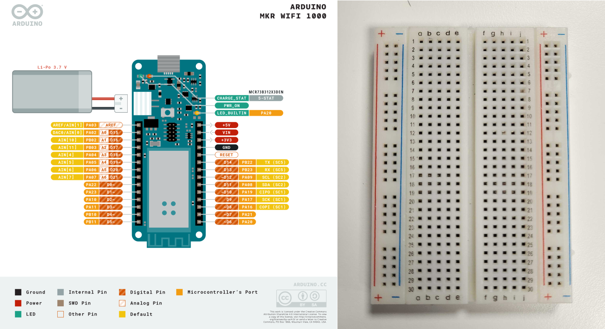
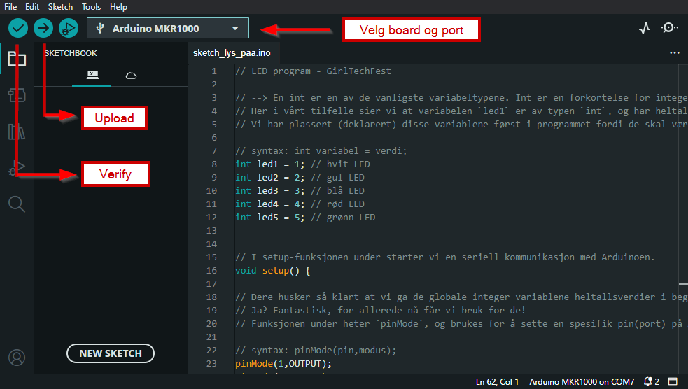

# Programmer julelys med Arduino og LEDs 🚦

## 🌈 Kort beskrivelse av oppgaven

Oppgaven baserer seg på en kobling mellom det å sette noe sammen selv og så se resultatet foran seg i real-time.

🎯 Målet er erfaringen av det at prøving og feiling ikke er en skummel prosess. At ved å teste ulike kombinasjoner av input i koden eller hvor man setter en ledning på koblingsbrettet, resulterer i noe nytt og spennende, og hvis det ikke funker så er det noe som lett kan fikses!

- Det blir utdelt PC'er med et ferdig nedlastet open-source script/program som får LED's (Light Emitting Diodes) til å blinke i en gitt rekkefølge, en Arduino (microcontroller), koblingsbrett, ledninger og LED's
- Programmet blir kjørt via Arduino IDE som er Arduino sitt eget open-source program, veldig ofte brukt til opplæring og er lett tilgjengelig.
- Fra PCen laster vi så opp scriptet til Arduinoen, som er koblet til PCen med vanlig micro HDMI kabel (standard lader til feks. Samsung mobiler)
- Etter scriptet er lastet opp til Arduinoen, vil den kjøre programmet kontinuerlig til en ny versjon er lastet opp. Så fort et script er lastet opp, kan Arduinoen kjøre det uten å være koblet til PC.
- Nedenfor er det en "bruksanvisning/fasit" på hvordan de kan koble opp LED's på koblingsbrettet, basert på det ferdige scriptet, men etter dette er det fritt frem å prøve seg frem!
  - Feks. hva skjer hvis vi kobler opp flere LED's på koblingsbrettet? 🤔
    - Hvordan må man oppdatere scriptet som følge?
    - Trenger vi flere komponenter?
    - På hvilke porter og pin's skal de nye ledningene gå til?

Til syvende og sist er dette en oppgave hvor man skal leke seg og utfordre nysgjerrigheten 🎨

## Komponentliste

| Komponent               | Beskrivelse                                     | Antall          |
| ----------------------- | ----------------------------------------------- | --------------- |
| PCer                    | For kjøring av kode                             | 1               |
| Arduino IDE             | Arduino sitt eget kodeprogram                   | 1 stk           |
| Kode                    | Open source kodesnipp fra Arduino               | 1               |
| Arduino                 | Microcontroller som vi kjører programmet inn på | 1 stk           |
| Koblingsbrett           | Også kalt "Breadboard" for å koble opp LEDs     | 1 stk           |
| LEDs                    | LEDs = Lys emitterede dioder                    | Så mange du vil |
| Kabler                  | For kobling mellom LED og Arduino pins          | Så mange du vil |
| Ground/jord kabel       | For å koble Arduino pin til jord (ground)       | 1 stk           |
| Micro USB til USB kabel | For kobling mellom Arduino og PC                | 1 stk           |

## Porter i oppkoblingen

I tabellen under vises portene vi skal bruke i oppgaven og en kort beskrivelse.

| Port (som vist på bildet) | Beskrivelse                                                                   | Plassering på koblingsbrett |
| ------------------------- | ----------------------------------------------------------------------------- | --------------------------- |
| GND                       | Jord/"ground". Man bruker vanligvis svart eller brun kabel for å indikere GND | Blå minus (-)               |
| D1~ (Port 1)              | Koblet til LED 1                                                              | `6 - e`                     |
| D2~ (Port 2)              | Koblet til LED 2                                                              | `12 - e`                    |
| D3~ (Port 3)              | Koblet til LED 3                                                              | `18 - e`                    |
| D4~ (Port 4)              | Koblet til LED 4                                                              | `24 - e`                    |
| D5~ (Port 5)              | Koblet til LED 5                                                              | `30 - e`                    |

I oppgaven bruker vi digitale pins/ports, og vi kan bruke alle fra `D0` til `D14`.

### Greit å vite om komponentene

- En LED har to pin`s, en lang og en kort. Den lange er strøm-inn og den korte er strøm-ut.
- På et breadboard/koblingsbrett finner du ytterst en rad markert med rød (+) og en rad markert med blå (-).
  - På disse radene kobles strøm-inn (rød pluss) og strøm-ut (blå minus).
  - Til høyre for denne er den en del som har en rekke med bokstaver (a,b,c,d og e) og en rad nedover med tall.
- Bokstav-rekke og tall-rad refereres til som: `"tall" - "bokstav"`
  - For eksempel: `2 - a`

> **Huskeregel for LEDs:** En grei huskeregel er at det som går ut av brettet går på minus (vanligvis strøm-ut til GND), og det som skal inn på brettet går på pluss (vanligvis strøm-inn, i dette tilfellet fra Arduino til LED)

## Fremgangsmåte for oppkobling av oppgave

### Koble til jord (GND)

Ta en svart eller brun kabel og sett den ene enden i GND porten på Arduinoen, og den andre enden i koblingsbrettet på blå minus (-).

### Koble opp LEDs

1. Koble den første LEDen med kort pin i blå minus (-) rad, og lange pin på `6 - a` på koblingsbrettet.
1. Ta så en kabel som matcher fargen på LED i `6 - e` på koblingsbrettet og i port 1 (D1~) på Arduino

Dette skal vi gjøre for de fem fargene av LED vi har, og etterhvert som vi kobler opp vil vi kunne se et mønster.

Under så har vi to bilder side om side. På bildet til venste ser vi hvordan vi kobler til GND og på bildet til høyre hvordan vi kobler til LEDs.

## Resultatet kan se noe slik ut

## Arduino

1. Åpne Arduino IDE programmet, og les gjennom koden.
1. Koble Arduino til PC-en med USB kabelen.
1. Sjekk at Arduino MKR1000 er valgt som Selected Board & Port.
1. Kompiler koden ved å trykke på haken oppe til venstre (Verify).
1. Last så opp koden til Arduino ved å trykke på pilen (Upload).

## Referanser

- [Arduino - Hjemmeside](https://www.arduino.cc/)
- [Arduino IDE - Nedlastning fra hjemmeside](https://www.arduino.cc/en/software)
- [Arduino IDE - Open-source GitHub repository](https://github.com/arduino/arduino-ide)
